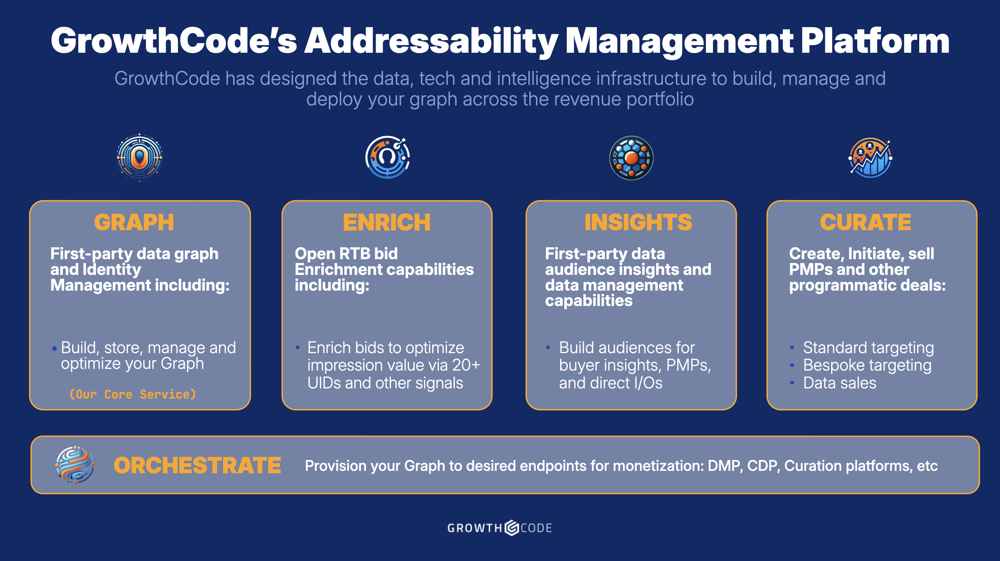

# GrowthCode Services & Benefits

## <mark style="color:blue;">Available GrowthCode Services:</mark>

<figure><figcaption>
GrowthCode Addressability Management Platform Products
</figcaption></figure>

#### <mark style="color:orange;">GrowthCode GRAPH:</mark>

The core of GrowthCode's offering is an ID graph-as-a-service. Our core Identity graph technology builds, optimizes and maintains an ID graph owned and controlled by you. GRAPH services include: &#x20;

* **Identity Graph Construction:** GrowthCode constructs a unique identity graph of your users, leveraging first, second, and third-party data sources to create a comprehensive view of audience behavior and preferences.
* **Event Ingestion and Audience Tracking:** Our integrated service ingests events and meticulously tracks audience behavior across various touch points, enabling granular insights into user engagement and interaction patterns.
* **Create** and/or sync the publisher or advertiser first party ID
* **Universal ID enrichment** & mapping
* **Contextual signal** enrichment

#### <mark style="color:orange;">GrowthCode ENRICH</mark>

This service integrates 20+ Universal Identities (UIDs) into a single script via one contract. These signals are then injected into the bidstream for use in multiple monetization use cases. ROUTER capabilities include:

* Minting all UIDs
* Single contract and single script to enable 20+ Universal Identities (UIDs)
* Bid signal enrichment with Universal IDs and contextual signals
* An optional A.I. Switchboard that optimizes routing of IDs to demand

#### <mark style="color:orange;">GrowthCode INSIGHTS</mark>

Leverage your first-party graph across your tech stack with data management capabilities to uncover and organize key audience insights into sales

* Data management capabilities to drive the business
* Build I/O, Deal ID and other structured audience offerings
* Deeper understanding of user community
* Build first-party audiences using buyer custom targeting parameters

#### <mark style="color:orange;">GrowthCode CURATE</mark>

Leverage your first-party graph to opt-in and build and curate structured deals:

* Offer PMP, Audience extension, re-targeting capabilities without cookies
* Maximize the impact of your first-party data across the business

#### <mark style="color:orange;">GrowthCode Data Orchestration:</mark>

* **GrowthCode optionally supports data orchestration to other key external platforms**: GrowthCode has already integrated with many leading curation platforms.  Partners can create their own curation seats or utilize GrowthCode’s existing relationships with these providers.  Further, GrowthCode can get your first-party data into CDPs, CRMs or data lakes

## <mark style="color:blue;">GrowthCode Benefits:</mark>

<mark style="color:blue;">By increasing addressability, GrowthCode delivers the following benefits to the digital advertising ecosystem</mark>

* **Increased Programmatic Revenue:** GrowthCode delivers higher RPMs for your Open RTB impressions by increasing the number and depth of the signals provided to SSPs, Exchanges, and DSPs. GrowthCode increases your inventory's value using curated PMPs that are not reliant on third-party cookies
* **Data Graph Ownership**: As an independent platform, GrowthCode empowers publishers and their approved technology partners to retain data ownership, fostering transparency and accountability in performance analysis.
* **Integrated Graph Connectivity:** Connect your first-party data directly to your programmatic channels, facilitating holistic audience targeting and campaign optimization.
* **Economical Data Management Capabilities:** Gain an unbiased and truthful view of performance metrics, enabling informed decision-making and resource allocation.
* **Support for Custom Buying Algorithms:** Today's media buyers will happily use use publisher first-party data but require the use of their own targeting definitions. GrowthCode enables sellers to map the unique buyer ‘recipe’ to the publisher first-party “ingredients” to generate scaled bespoke campaigns.
